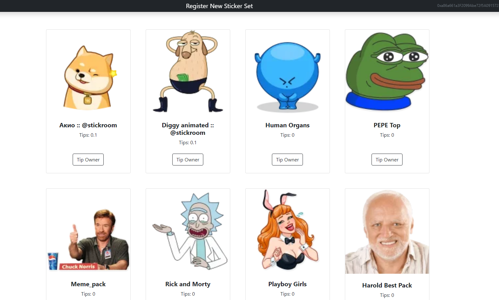

#  Tip Sticker Sets

Tip sticker sets is a web application where people could tip Telegram stickers' owners within the Ethereum network. Owners can register and verify their sticker sets, and then visitors could browse verified sticker sets repository to find the one they feel comfortable tipping. Tips will directly transfer to the owner's wallet address. This is my very first web3 project.


### Application Preview

https://tipstickers.herokuapp.com



## About the **Project**

This project is built using Node.js and React(MERN stack). Smart contracts are written in solidity and deployed to the Ropsten Ethereum test network.
As you might know, Telegram offers custom stickers, meaning that any user can easily create their own stickers within the platform. This service allows sticker owners to list their stickers so other people can come and tip them. The tip amount is currently fixed and set to 0.1eth. 

There is no built-in mechanism in Telegram by which you could verify ownership of someone's sticker. Therefore, I came up with a custom mechanism for that: 
1. sticker owner enters their sticker's name.
2. If sticker set name is valid, a picture will show up for the owner.
3. Owner should save the picture and add the picture as a sticker to the sticker set entered in the previous step. (this step is done within the Telegram app).
4. After the owner is done with adding the new sticker to the set, they will click on "verify ownership" button.
5. Application then automatically goes and fetches the last sticker in that sticker set and compares it with the original picture.
6. If the text inside the sticker is equal to that of the picture(using OCR), ownership is proved. Otherwise, ownership is rejected.

> \* In all these steps owner has their wallet connected to the application.

When the verification process is completed, the sticker set is listed and ready to receive tips from users.


## Installation

> \* Make sure you have installed Node Version `16.0` or higher.

Inside root directory:

```bash
npm run install-client
npm run install-server
npm start
```
>\* Note that by default the contract deployment is set to run on Ropsten network. If you plan to work with local networks like Ganache, change scripts accordingly. e.g. modify 'truffle migrate --network ropsten' to 'truffle migrate'.

### Testing

Running server-side tests.
Inside server directory type:
```bash
npm test
```
Running client-side tests(only for contracts).
Inside client directory type:
```bash
truffle test
```